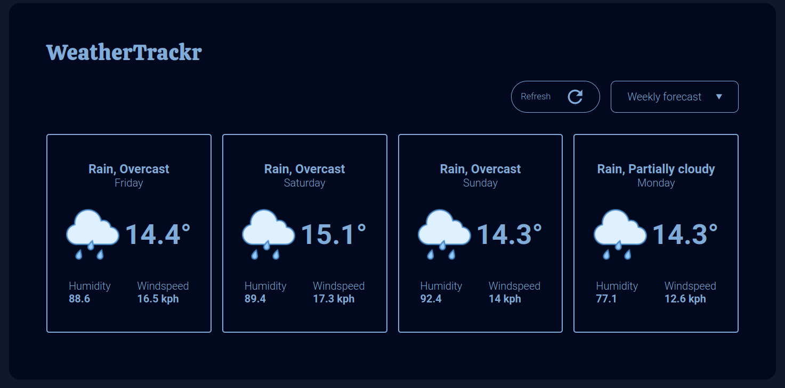
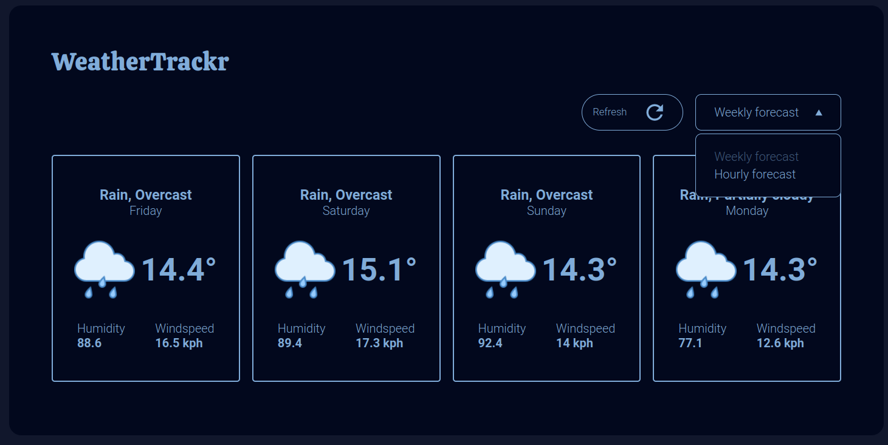
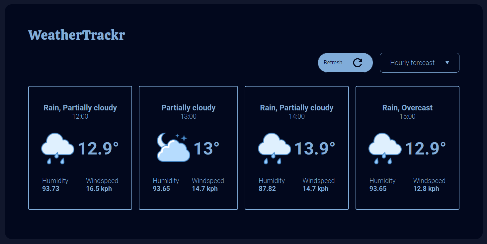

# WeatherTracker

Small project using the <a href="https://www.visualcrossing.com/">VisualCrossing<a>'s weather API.  
It's doesn't have a bunch of functionality, it's just a small weather tracker to get familiar with API's.  
All weather icons are from <a href="https://icons8.com/icon/set/weather/ultraviolet">Blue UI weather icon set.</a>  
And icons on dropdown and refresh button are taken from <a href="https://pictogrammers.com/library/mdi/">Material design icons.</a>

